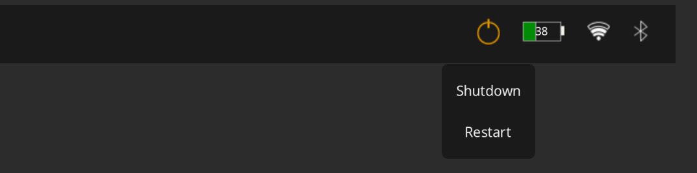

# EwwBar

A minimal bar built using **Eww** for Linux (Tested on plasma kde wayland on linux arch only). Displays workspaces, time, battery, power profile, Wi-Fi, Bluetooth, and a power menu.

## Features

- **Workspace Switcher**: Quickly switch between workspaces. Highlights the active workspace (Currently coded to show 4 workspaces. Dynamic menu can be added to show as many as available).
- **Datetime**: Displays current date and time in `DD Mon | HH:MM:SS` format.
- **Battery**: Shows battery status with dynamic icons and a tooltip indicating the power profile.
- **Power Profile**: Toggle between `power-saver`, `balanced`, and `performance` modes directly from the bar.
- **Wi-Fi**: Displays Wi-Fi status, connected network, and signal strength (4 levels). Right-click to open network settings. Click to toggle Wi-Fi.
- **Bluetooth**: Shows status, connected device, and provides a right-click shortcut to Bluetooth settings. Click to toggle Bluetooth.
- **Power Menu**: Expandable menu with `Shutdown` and `Restart` options.
- **Uptime Tooltip**: Hovering on the power button shows uptime in days, hours, and minutes.

## Screenshots

### Main Bar

### Power Menu

